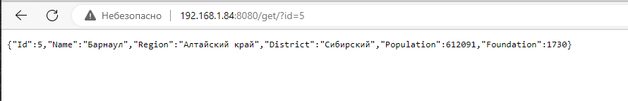
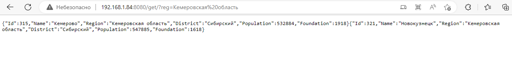
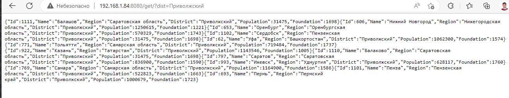
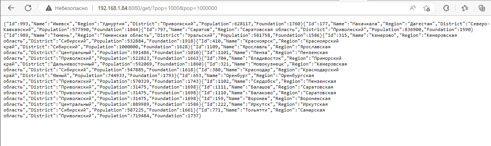
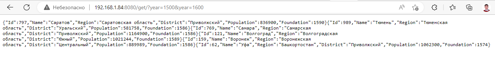

# Работа на промежуточную аттестацию для модуля «Go-разработчик»
## Файл настройки
my_conf.yml
```yaml
apport: 8080
```
Задаем порт который слушает приложение
## Запуск
ключ -import позволяет импортировать при запуске csv файл.  
Далее в момент старта сервиса  данные из файла кешируются в память.      
В момент завершения работы сервиса данные  перезаписываются в файл database.json    
Если при первичном запуске файла database.json нет то автоматом запускается импорт из csv
## Логи 
пишутся в log.txt после запуска

## API
### Требуется реализовать сервис имеющий следующий функционал:

###  Получение информации о городе по его id;
Запрос типа GET /get/?id=5


### Добавление новой записи в список городов;
```bash
curl -X POST -d '{"Name":"Пенза","Region":"Пензенская область","District":"Приволжский","Population":522823,"Foundation":1663}' http://192.168.1.84:8080/create
```
Запрос возвращает текст "City was added Пенза" и 201

### Удаление информации о городе по указанному id;
```bash
curl -X DELETE -d '{"source_id":"1002"}' http://192.168.1.84:8080/delete
```
Помимо кода 200 возвращает:
```bash
There is no city in map as: Ульяновск
```
### Обновление информации о численности населения города по указанному id;
```bash
curl -X PUT -d '{"new pop":"5321000"}' http://192.168.1.84:8080/5  
```
Помимо кода 200 возвращает:
```bash
Population is changed in city:Барнаул
```
### Получение списка городов по указанному региону;
Запрос типа GET /get/?reg=value

### Получение списка городов по указанному округу;
Запрос типа GET /get/?dist=value

### Получение списка городов по указанному диапазону численности населения;
Запрос типа GET /get/?pop=value1&pop=value2 (сервер сам выберет минимальное и максимальное значение)


### Получение списка городов по указанному диапазону года основания.
Запрос типа GET /get/?year=value1&year=value2 (сервер сам выберет минимальное и максимальное значение)


