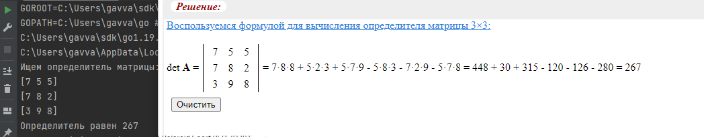
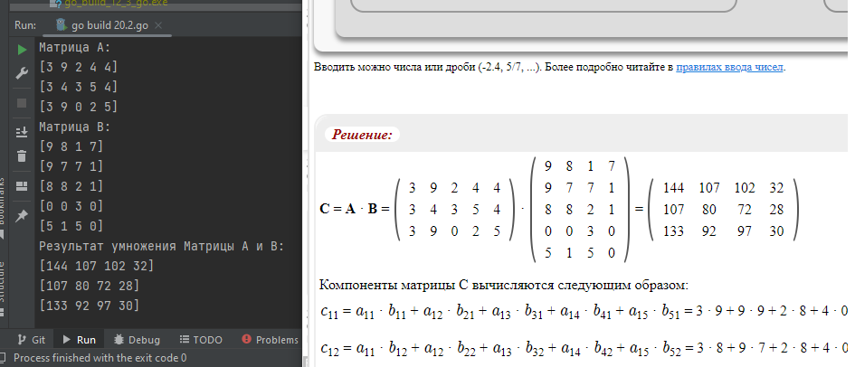

## Задание 1. Подсчёт определителя
Что нужно сделать:  
Напишите функцию, вычисляющую определитель матрицы размером 3 × 3.
````
Результат проверки на калькуляторе верности операции  
````

## Задание 2. Умножение матриц
Что нужно сделать:  
Напишите функцию, умножающую две матрицы размерами 3 × 5 и 5 × 4.  
````
Результат проверки на калькуляторе верности произведения  
````

