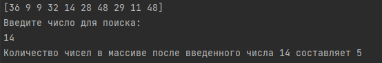
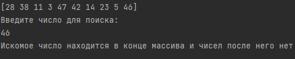
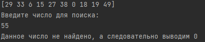

# 22.5 Практическая работа

## Задание 1. Посчитать числа в неупорядоченном массиве после заданного числа
### Что нужно сделать
Заполните массив неупорядоченными числами на основе генератора случайных чисел.  
Введите число. Программа должна найти это число в массиве и вывести, сколько чисел находится в массиве после введённого.   
При отсутствии введённого числа в массиве — вывести 0.  
Для удобства проверки реализуйте вывод массива на экран.
### Ответ
Файл
```
 22.1.go
```
Результаты:  




## Задание 2. Нахождение первого вхождения числа в упорядоченном массиве (числа могут повторяться)
Заполните упорядоченный массив из 12 элементов и введите число.  
Необходимо реализовать поиск первого вхождения заданного числа в массив.   
Сложность алгоритма должна быть минимальная.  
При вводе массива 1 2 2 2 3 4 5 6 7 8 9 10 и вводе числа 2 программа должна вывести индекс 1.
### Ответ