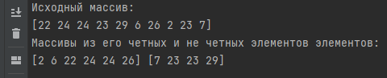
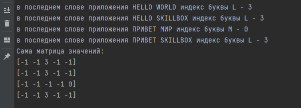

# 23.6 Практическая работа
### Цель домашнего задания
### Освоить использование динамических массивов.

### Задание 1. Чётные и нечётные
Что нужно сделать
Напишите функцию, которая принимает массив чисел, а возвращает два 
массива:один из чётных чисел, второй из нечётных.

### Решение  

### Файл 
23.1.go

### Задание 2. Поиск символов в нескольких строках
Что нужно сделать
Напишите функцию, которая на вход принимает массив предложений (длинных строк) и массив символов типа rune, а возвращает 2D-массив, где на позиции [i][j] стоит индекс вхождения символа j из chars в последнее слово в предложении i (строку надо разбить на слова и взять последнее). 

### Решение

### Файл 
23.2.go  