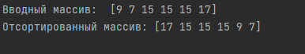

# 24. Композитные типы данных. Срезы. Динамическое выделение памяти
## 24.6 Практическая работа
### Задание 1
### Что нужно сделать
Напишите функцию, сортирующую массив длины 10 вставками.
### Файл
24.2.go
### Решение

### Задание 2. Анонимные функции
### Что нужно сделать
Напишите анонимную функцию, которая на вход получает массив типа integer,  
сортирует его пузырьком и переворачивает (либо сразу сортирует в обратном порядке,   
как посчитаете нужным).
### Файл
24.2.go
### Решение
