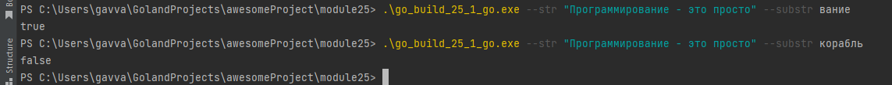

# 25. Подмножества и работа со срезами памяти
## 25.9 Практическая работа
### Задание 1
### Что нужно сделать
Написать программу для нахождения подстроки в кириллической подстроке. Программа должна запускаться с помощью команды:

go run main.go --str "строка для поиска" --substr "поиска"

Для реализации такой работы с флагами воспользуйтесь пакетом flags, а для поиска подстроки в строке вам понадобятся руны.

Что нужно сделать
* Спроектировать алгоритм поиска подстроки.
* Определить строку и подстроку, используя флаги.
* Написать алгоритм реализацию для работы со строками UTF-8 (для этого необходимо воспользоваться рунами).

### Файл
25.1.go
### Решение
