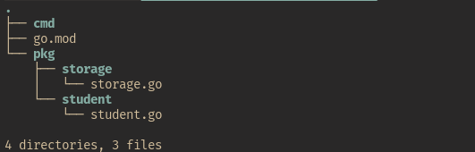
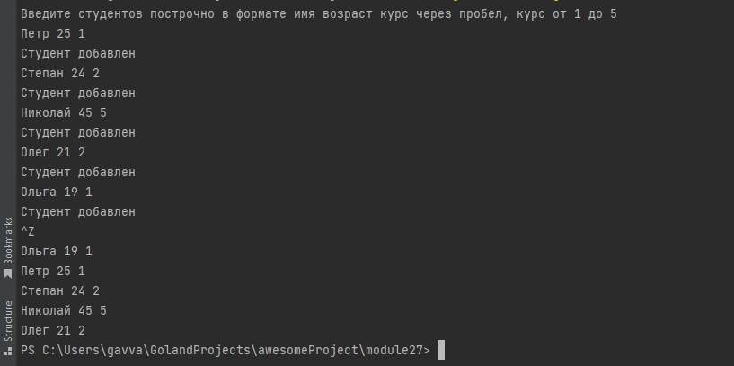

# 27. Композитные типы данных. Карты и структуры
## 27.7 Практическая работа
### Задание 1
### Цель задания
Научиться работать с композитными типами данных: структурами и картами

### Что нужно сделать
В прошлом домашнем задании вы написали программу для работы со студентами. Мы указываем в стандартный ввод данные о студенте, а после получения сигнала об окончании работы программы она выводит имена всех студентов на экран.

Вам нужно отрефакторить код прошлого домашнего задания. Декомпозируйте его так, чтобы логике одной сущности соответствовал один пакет.

Для того, чтобы вы могли использовать методы и переменные, которые объявлены в других пакетах, сделайте их экспортируемыми.

Структура программы после рефакторинга может выглядеть следующим образом:

### Что оценивается
* при получении одной строки (например, «имяСтудента 24 1») программа создаёт студента и сохраняет его, далее ожидает следующую строку или сигнал EOF (Сtrl + Z);
* при получении сигнала EOF программа должна вывести имена всех студентов из map.
### Файл
27.1.go
### Решение
