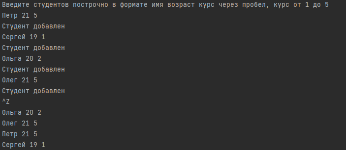

# 28. Переиспользование кода, модульность
## 28.5 Практическая работа
### Задание 1
### Цель задания
Научиться работать с композитными типами данных: структурами и картами

### Что нужно сделать
Напишите программу, которая считывает ввод с stdin, создаёт структуру student и записывает  
указатель на структуру в хранилище map[studentName] *Student.  
Программа должна получать строки в бесконечном цикле, создать структуру Student через функцию newStudent,  
далее сохранить указатель на эту структуру в map, а после получения EOF (ctrl + d)  
вывести на экран имена всех студентов из хранилища. Также необходимо реализовать методы put, get.

### Что оценивается
* при получении одной строки (например, «имяСтудента 24 1») программа создаёт студента и сохраняет его, далее ожидает следующую строку или сигнал EOF (Сtrl + Z);
* при получении сигнала EOF программа должна вывести имена всех студентов из map.
### Файл
27.1.go
### Решение
