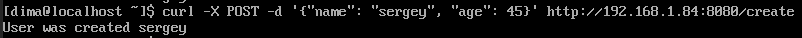
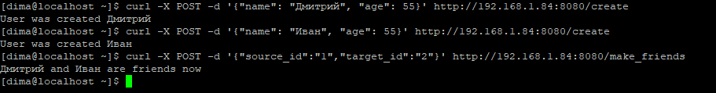
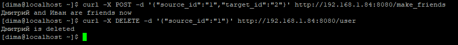
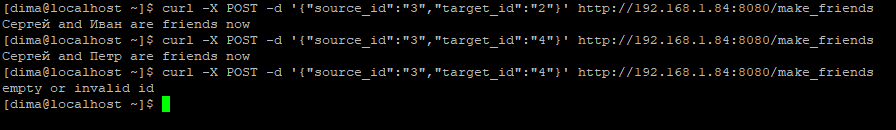
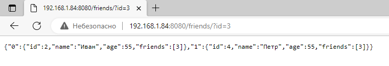
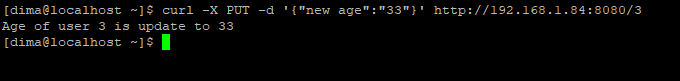

# 30.5 Практическая работа
## Цель практической работы
Научиться:

работать с запросами POST, GET, PUT, DELETE;
применять принципы написания обработчиков HTTP-запросов.

## Что нужно сделать
Напишите HTTP-сервис, который принимает входящие соединения с JSON-данными и обрабатывает их следующим образом:

1. Сделайте обработчик создания пользователя. У пользователя должны быть следующие поля: имя, возраст и массив друзей.
Пользователя необходимо сохранять в мапу.
Данный запрос должен возвращать ID пользователя и статус 201.

2. Сделайте обработчик, который делает друзей из двух пользователей. Например, если мы создали двух пользователей 
и нам вернулись их ID, то в запросе мы можем указать ID пользователя, который инициировал запрос на дружбу, 
и ID пользователя, который примет инициатора в друзья. 

3. Сделайте обработчик, который удаляет пользователя. Данный обработчик принимает ID пользователя и удаляет
   его из хранилища, а также стирает его из массива friends у всех его друзей

4. Сделайте обработчик, который возвращает всех друзей пользователя. 

5. Сделайте обработчик, который обновляет возраст пользователя. 
