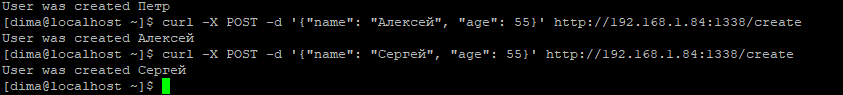
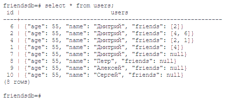
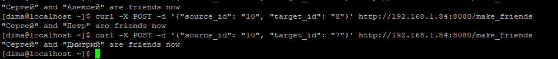
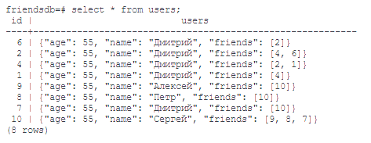
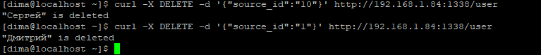
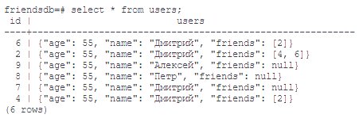
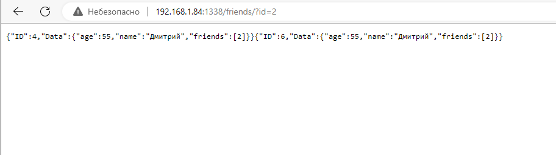
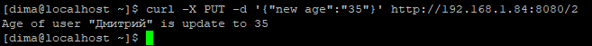
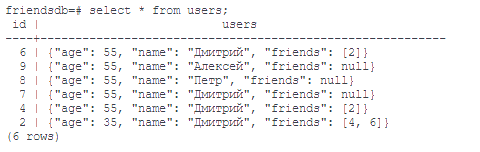

# 31.5 Практическая работа
## Цель практической работы
Научиться:

работать с запросами POST, GET, PUT, DELETE;
применять принципы написания обработчиков HTTP-запросов.


## Что нужно сделать
Что нужно сделать
В прошлом домашнем задании вы писали приложение, которое принимает HTTP-запросы, создаёт пользователей, добавляет друзей и так далее. Давайте теперь приблизим наше приложение к реальному продукту.

Отрефакторьте приложение так, чтобы вы могли поднять две реплики данного приложения.
Используйте любую базу данных, чтобы сохранять информацию о пользователях, или можете сохранять информацию в файл, предварительно сереализуя в JSON.
### Ответ
Выбрана Postgres, схема таблицы для данных:
```sql
CREATE TABLE Users (
id SERIAL PRIMARY KEY,
users JSONB);
```
  

Напишите proxy или используйте, например, nginx.
### Ответ
/proxy/proxy.go

Протестируйте приложение.

1. Сделайте обработчик создания пользователя. У пользователя должны быть следующие поля: имя, возраст и массив друзей.
Пользователя необходимо сохранять в Базу данных.
Данный запрос должен возвращать ID пользователя и статус 201.



2. Сделайте обработчик, который делает друзей из двух пользователей. Например, если мы создали двух пользователей 
и нам вернулись их ID, то в запросе мы можем указать ID пользователя, который инициировал запрос на дружбу, 
и ID пользователя, который примет инициатора в друзья. 


3. Сделайте обработчик, который удаляет пользователя. Данный обработчик принимает ID пользователя и удаляет
   его из хранилища, а также стирает его из массива friends у всех его друзей


4. Сделайте обработчик, который возвращает всех друзей пользователя. 

5. Сделайте обработчик, который обновляет возраст пользователя. 

